# Quickstart : A journey throught the Iris dataset

## Introduction

The Iris flower dataset is a multivariate dataset introduced by the British statistician and biologist Ronald Fisher in his 1936 paper "The use of multiple measurements in taxonomic problems" as an example of linear discriminant analysis. It consists of 50 samples from each of three species of Iris (Iris setosa, Iris virginica and Iris versicolor). Four features were measured from each sample: the length and the width of the sepals and petals, in centimeters. The Iris dataset is widely used in machine learning as a benchmark dataset for statistical classification algorithms. It is free and publicly avaible at the [UCI Machine Repository](https://archive.ics.uci.edu/ml/datasets/iris).

The following tutorial allows to illustrate main Chalk'it features througth this dataset. Expected result is provided in the following project:

- [iris-tutorial.xprjson](/quick-start/xprjson/iris-tutorial.xprjson)

## 1. Create a projet

Run Chalk'it in the command line:

```sh
chalk-it
```

Then, click *My Project* button to reach project editor on the *Discover Chalk'it* menu.


Name the new projet *iris-tutorial* by filling the title form, then save it using the *Save* button.

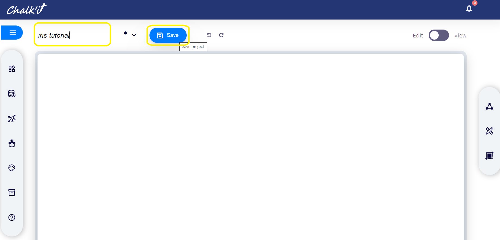

An iris-tutorial.xprjson is then created in your current directory (directory where the chalk-it command was run).

## 2. Load required Python Pyodide librairies

Using the _Project librairies_ main tab, load the following required librairies: **pandas**, **scikit-learn** (from the _Standard Librairies_ tabset) and **plotly** (from the _Micropip Librairies_ tabset). Use the search bar to ease the process.

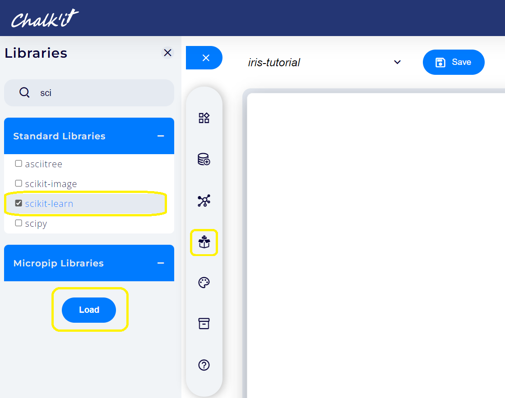

## 3. Load dataset data

Create a datanode named **dataset** to load the Iris dataset from **Scikit-learn** by following the next instructions:

- Click on _Datanodes_ main tab, then on _New_ button:

  

- Select _Script (Pyodide)_ from the list of datanode types:

  

- Enter **dataset** in the _NAME_ field and copy the following code into the _PYTHON SCRIPT_ field:

  ```Python
  from sklearn import datasets
  iris=datasets.load_iris()
  return iris
  ```

  This step is illustrated below:

  

- Finally, click on _Save_ button for validation.

Datanode execution status and result are now available and can be previewed in the **dataset** window as follows:

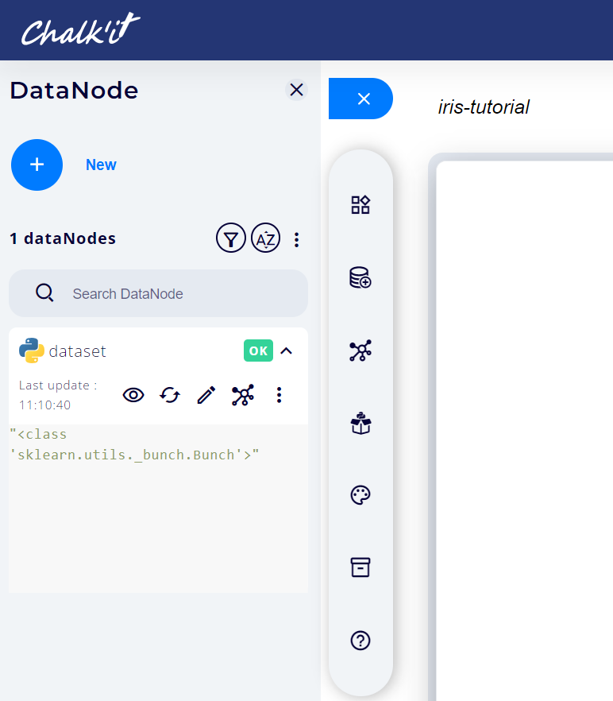

## 4. Visualize the dataset

Visualize the dataset in 4 steps:

#### Step1: prepare the data

- To load the dataset in a Pandas dataframe, follow the procedure described in paragraph **2.** to create a new _Script (Pyodide)_ datanode. The main differences are:

  - Enter **datasetDataframe** in _NAME_ field,
  - Copy the following code in _PYTHON SCRIPT_ field.

  ```Python
  import pandas as pd

  iris=dataNodes["dataset"]

  df = pd.DataFrame(data=iris.data, columns=iris.feature_names)
  df["target"] = iris.target
  target_names = {0: "Setosa", 1: "Versicolour", 2: "Virginica" }
  df['target'] = df['target'].map(target_names)

  return df
  ```

  The expression **dataNodes["dataset"]** indicates Chalk'it to read the last execution output of the **dataset** datanode. It also establishes a data and execution flow dependency between **dataset** and **datasetDataframe**.

- To visualize the dataset using _Plotly Python_ librairy, create a new _Script (Pyodide)_ datanode, name it **plot**, then copy the following code in _PYTHON SCRIPT_ field.

  ```Python
  import plotly.express as px

  df = dataNodes["datasetDataframe"]
  fig = px.scatter(df, x="sepal width (cm)", y="sepal length (cm)", color="target", size='petal length (cm)', hover_data=['petal width (cm)'])

  return fig
  ```

#### Step2: create the dashboard

- To browse the widgets libraries, click on _Widgets_ main tab, then open the _Plots_ category as shown below:

  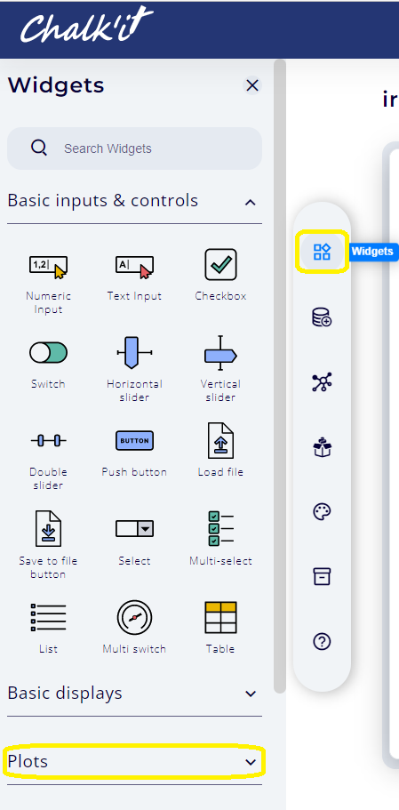

- To add a _Plotly Python_ widget to the dashboard editor, click on the corresponding icon or just perform a drag and drop.

  

#### Step3: connect dataNode to widget

- Click on the pencil icon on the top-right corner of the widget to display the widget menu. Select then _Connect widget_ as shown below:

  

- A panel will then be displayed on the right-side of the screen. From the connection dropdown, select the datanode _plot_, as it will provide the figure object needed for the widget. Click _Save_ to validate the choice.

  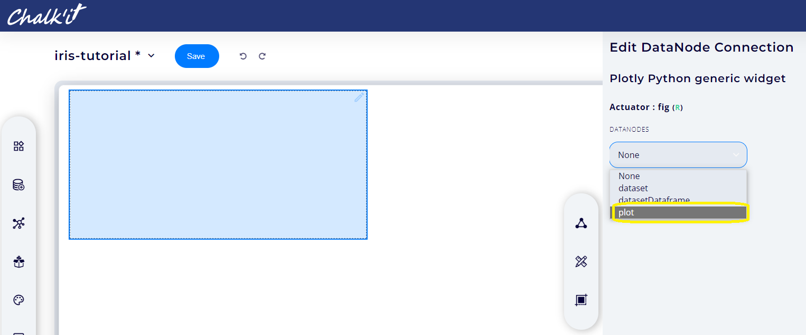

#### Step4: Preview the dashboard

- A static preview of the figure is then provided. The widget can be moved or resized as needed. The \*View\* mode can be selected to start interactive visualization.

  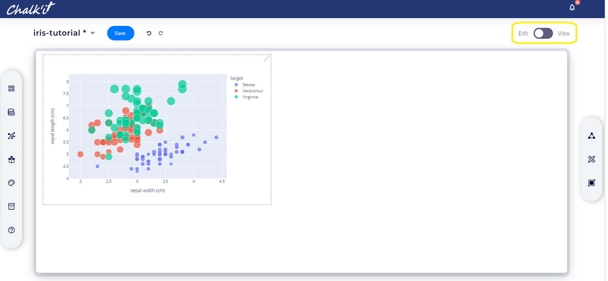

## 5. Interactive predictor with classifier training

The goal is now to use the previously trained classifier to predict Iris species based on petal and sepal width and length.

### Classifier training

Following the steps already described in paragraph **2.**, create a _Script (Pyodide)_ datanode named **classifier** and use the following python script as shown in the picture below.

```Python
from sklearn.ensemble import RandomForestClassifier
clf=RandomForestClassifier()
clf.fit(dataNodes["dataset"].data,dataNodes["dataset"].target)
return clf
```

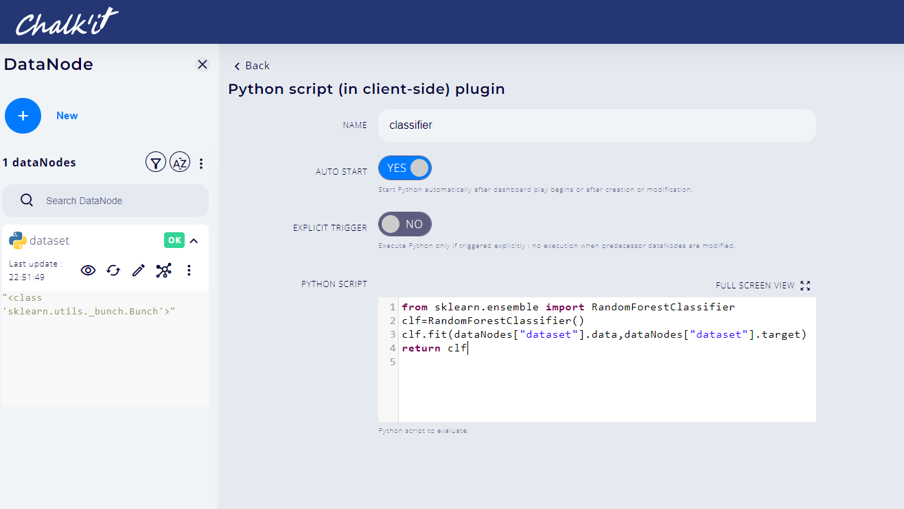

The result should look like:


### Interactive predictor

- Create a JSON Variable datanode named **inputs** using _JavaScript workspace variable_ type. Use the following JSON definition:

  ```JSON
  {"sepal_width":5.4,"sepal_length":2.7,"petal_length":3,"petal_width":0.5}
  ```

The result should be as follow:
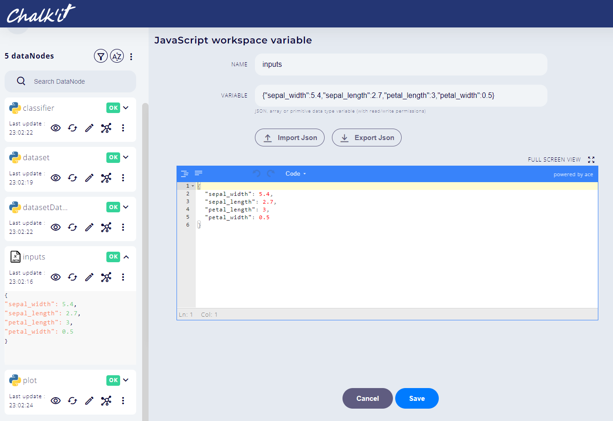

- Add four horizontal sliders to pilot the values of "sepal*width","sepal_length", "petal_length" and "petal_width". First click the \_Widgets* main tab, then _basic inputs & controls_.

  

- Connect each slider to its corresponding feature as shown below:

  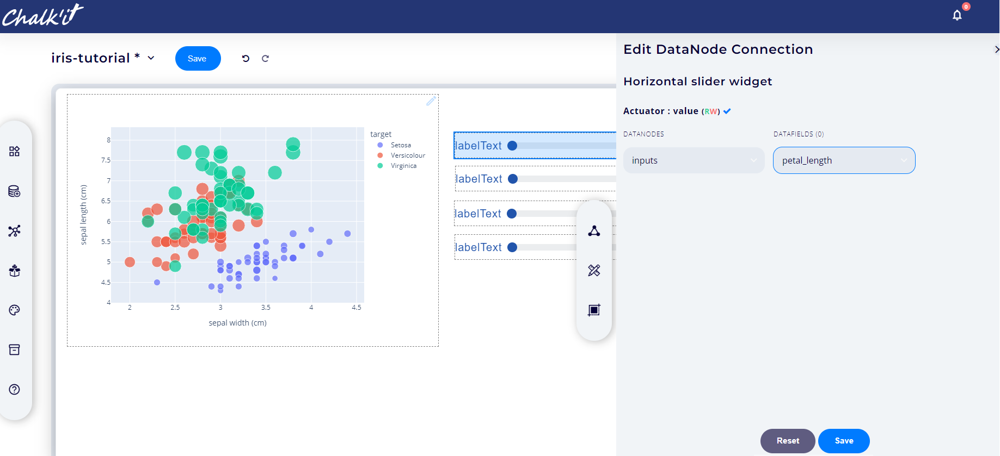

- Configure sliders properties with a sliding step of 0.1 and min/max values as stated in the following table:

  | Feature      | min | max |
  | ------------ | --- | --- |
  | sepal_width  | 4.3 | 7.9 |
  | sepal_length | 2.0 | 4.4 |
  | petal_width  | 0.1 | 2.5 |
  | petal_length | 1.0 | 6.9 |

For this purpose, select the _Graphical properties_ tab of each widget as illustrated below:


- Add a _Script (Pyodide)_ datanode named **predict** with the following code:

  ```Python
  import pandas as pd
  from sklearn.ensemble import RandomForestClassifier

  df =pd.DataFrame(dataNodes["inputs"],index=[0])
  clf = dataNodes["classifier"]

  prediction=clf.predict(df)

  return dataNodes["dataset"].target_names[prediction][0]
  ```

- Go back to the _Widgets_ main tab, open the _Basic Displays_ tabset, and then add a _KPI value_ widget

  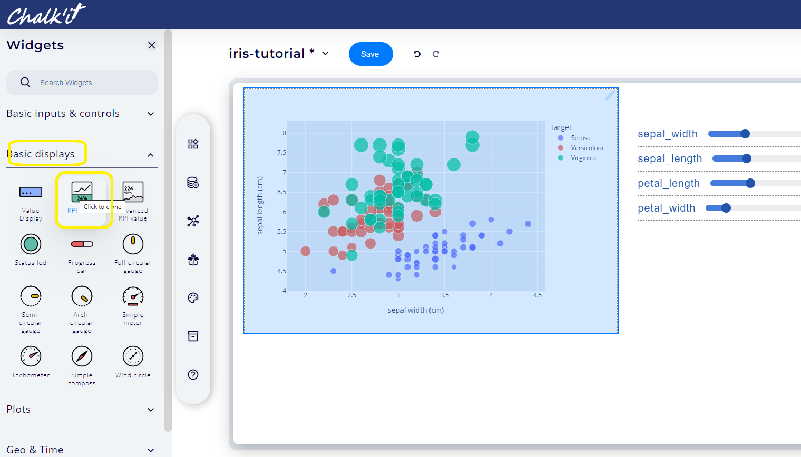

- Connect this widget to the **predict** datanode.

- Switch to \*View\* mode. Use the sliders to change Iris features and view prediction result accordingly:

  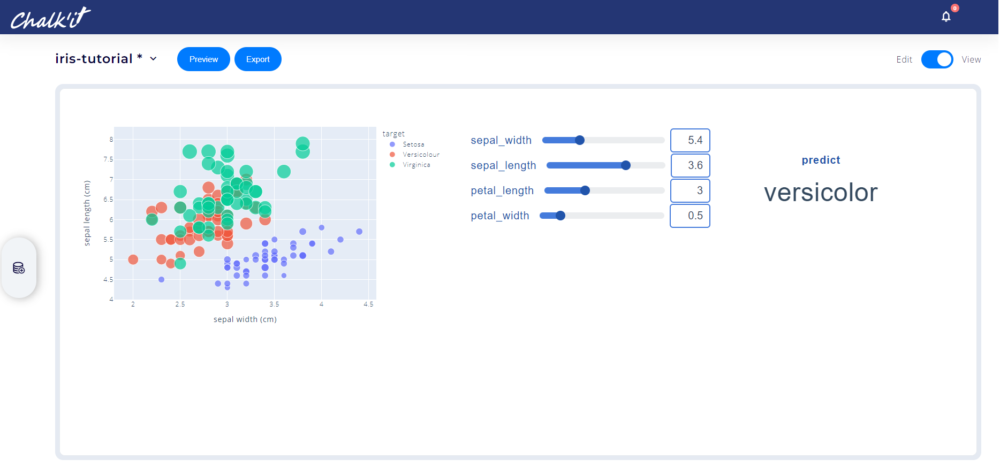

Note that computation will be triggered every time a slider is changed.

**Explicit trigger**

Sometimes a different behaviour is needed, a form-like behaviour where the predictor execution is triggered only when a button is clicked.

This behaviour can be achieved through the following steps :

- Switch to \*Edit\* mode. Add a button widget, connect it to the **predict** datanode, and name it **Run**.

  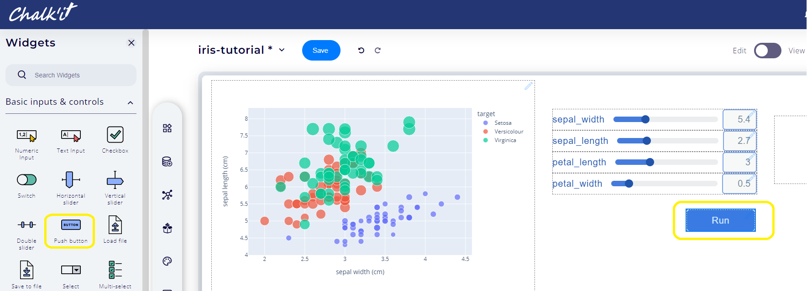

- Open the datanode **predict**, switch the _EXPLICIT TRIGGER_ parameter to _YES_.

  

- Switch back to \*View\* mode to test the new behaviour.

- This project, when finished, can be previewed or exported to a standalone HTML page or your app can be deployed and shared using a public or a private link.
